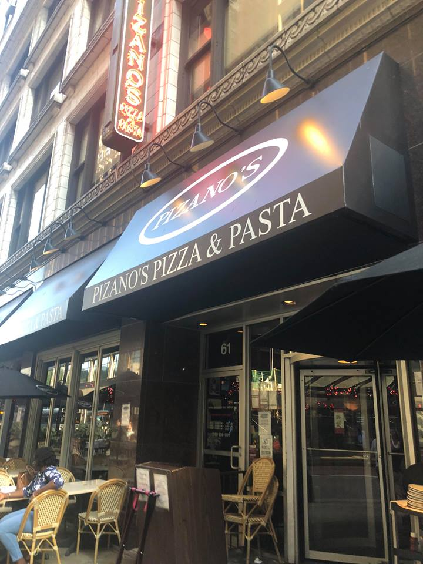
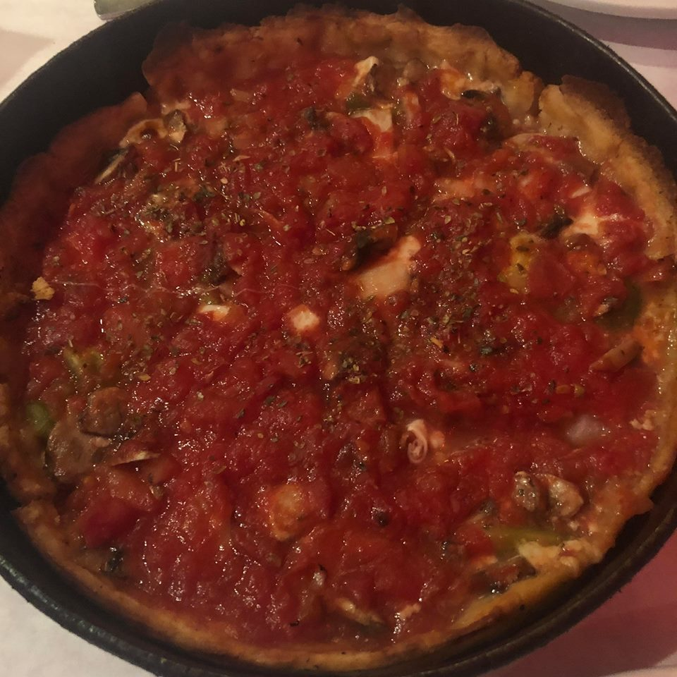

### Pizano's Pizza & Pasta
Location: 61 E. Madison St.

Crust: 9/10 
Pizza: 8/10

Pizano's deep dish pizza is actually quite thin compared to the standard
Chicago-style deep dish. The cheese and sauce were decent, and the crust (both
bottom and the sides) are fairly thin and a little crispy. If you've had Lou
Malnati's pizza, Pizano's is quite similar, especially the side crust. Fun
fact: Pizano's was founded by Lou Malnati's brother.

Deep dish veggie pizza

